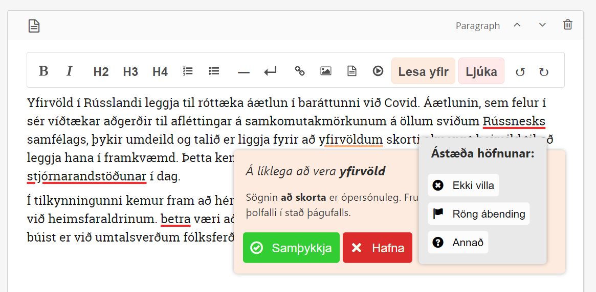

# Icelandic spelling and grammar correction for Draftail

This repository contains source code and development environment for a [Draftail](https://www.draftail.org/) spelling and grammar annotation plugin for use with the [Wagtail CMS](https://wagtail.org/) admin interface, configured for Icelandic.

The plugin uses the [Yfirlestur.is](https://yfirlestur.is/) API for spelling and grammar correction, which runs [GreynirCorrect](https://github.com/mideind/GreynirCorrect). Both are maintained by [Miðeind](https://xn--mieind-qwa.is/).

The plugin was developed for, and is configured for use with, the [Kjarninn](https://kjarninn.is/) editorial environment, which uses a standard Wagtail admin interface.

## Functionality

The annotation functionality of the plugin and interactive UI is based on pre-existing [in line entity](https://www.draftail.org/docs/entities) frameworks of the Draftail editor, written in React. As Draftail is based on the widely used [Draft.js](https://draftjs.org/) editor, functionality more specific to Draft.js is used where possible.

### Django app
The custom entity functionality of the plugin is contained within a specific Django app. This is labeled [`ui_test`](apps/ui_test).

The plugin technically consists of two sub-plugins: one for the general functionality of in-line annotations and the other for the removal of all annotations in the text. These sub-plugins each consist of a source and an entity, which are registered to the DOM through [the app's Wagtail hooks](apps/ui_test/wagtail_hooks.py).

### Annotation

The annotation functionality of the plugin is contained within [a specific entity](apps/ui_test/static/js/components/AnnotationEntity.js), with [it's source](apps/ui_test/static/js/sources/AnnotationSource.js) contained separately. Necessary utilities are contained in [a separate directory](apps/ui_test/static/js/utils).

This entity handles most functionality of the in line annotations:

- API interaction
- UI rendering
- Text substitution

The annotation source is registered to the DOM as a toolbar button, which is the standard approach for Wagtail Plugins. Wider functionality is controlled through rendered UI, contained within the annotation entity.

### Annotation removal 

The second sub-plugin controls the removal of all annotation entities present in the editor. This should be thought of as a "clear all" functionality, used after checking the editor text for errors.

Like the wider annotation functionality, it consists of [a specific source file](apps/ui_test/static/js/sources/RemoveAnnotationsSource.js) and an entity which are registered through Wagtail hooks. However, the entity for annotation removal does not render anything and only the entity source is run when called.

For the end user, this functionality is controlled through a separate editor toolbar button. 

### Notes

The in-line entity functionality of Draftail, used here for rendering annotations, is intended for end user use, with specific functionality and rendering in the respective website's front end. This was not the goal of this project, as the in-line spelling and grammar annotations only serve a purpose within the Wagtail admin interface.

For this reason, the plugin consists of the two sub-plugins described above, with the "annotation removal" functionality integral to the workflow of the plugin. This is to ensure that no annotation entities are rendered in the end application of the text being annotated.

A rework of this system would be beneficial for future applications of this plugin.

## Acknowledgments
- University of Iceland

This project was funded by the Language Technology Programme for Icelandic 2019-2023. The programme, which is managed and coordinated by [Almannarómur](https://almannaromur.is/), is funded by the Icelandic Ministry of Education, Science and Culture.

## License 

This software is licensed under the MIT License:

Permission is hereby granted, free of charge, to any person obtaining a copy of this software and associated documentation files (the "Software"), to deal in the Software without restriction, including without limitation the rights to use, copy, modify, merge, publish, distribute, sublicense, and/or sell copies of the Software, and to permit persons to whom the Software is furnished to do so, subject to the following conditions:

The above copyright notice and this permission notice shall be included in all copies or substantial portions of the Software.

THE SOFTWARE IS PROVIDED "AS IS", WITHOUT WARRANTY OF ANY KIND, EXPRESS OR IMPLIED, INCLUDING BUT NOT LIMITED TO THE WARRANTIES OF MERCHANTABILITY, FITNESS FOR A PARTICULAR PURPOSE AND NONINFRINGEMENT. IN NO EVENT SHALL THE AUTHORS OR COPYRIGHT HOLDERS BE LIABLE FOR ANY CLAIM, DAMAGES OR OTHER LIABILITY, WHETHER IN AN ACTION OF CONTRACT, TORT OR OTHERWISE, ARISING FROM, OUT OF OR IN CONNECTION WITH THE SOFTWARE OR THE USE OR OTHER DEALINGS IN THE SOFTWARE.

